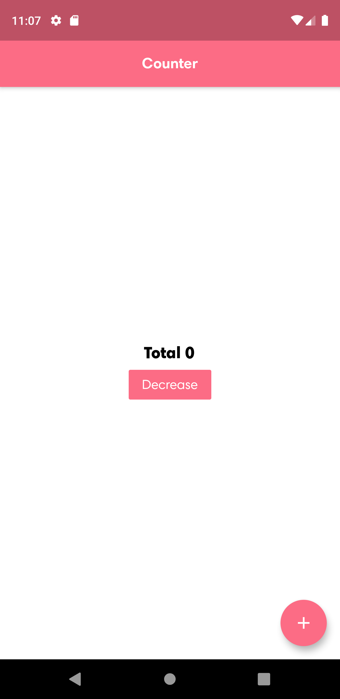

# Counter

Awesome mobile app for counter with bloc.

## Quick start

- Get packages from **pub** for Flutter app:

```bash
flutter pub get
```

- Run project:

```bash
flutter run
```

## Screenshot

<span><span/>

## Contributors

[](https://sourcerer.io/fame/tvc12/tvc12/counter_bloc_simple/links/0)[](https://sourcerer.io/fame/tvc12/tvc12/counter_bloc_simple/links/1)[](https://sourcerer.io/fame/tvc12/tvc12/counter_bloc_simple/links/2)[](https://sourcerer.io/fame/tvc12/tvc12/counter_bloc_simple/links/3)[](https://sourcerer.io/fame/tvc12/tvc12/counter_bloc_simple/links/4)[](https://sourcerer.io/fame/tvc12/tvc12/counter_bloc_simple/links/5)[](https://sourcerer.io/fame/tvc12/tvc12/counter_bloc_simple/links/6)[](https://sourcerer.io/fame/tvc12/tvc12/counter_bloc_simple/links/7)

Build with 🙌 + ❤️
